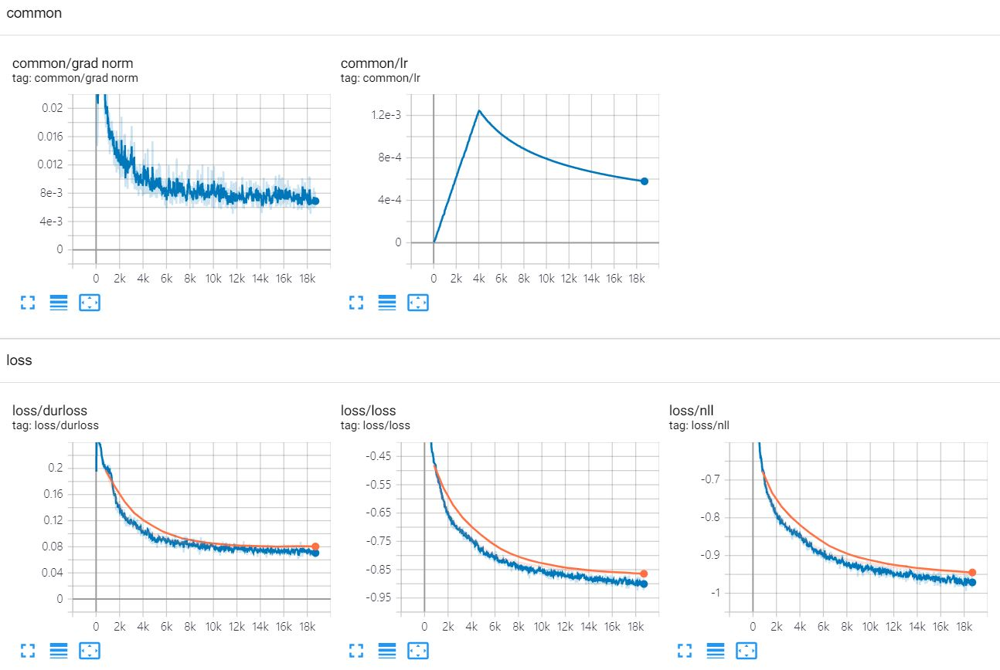
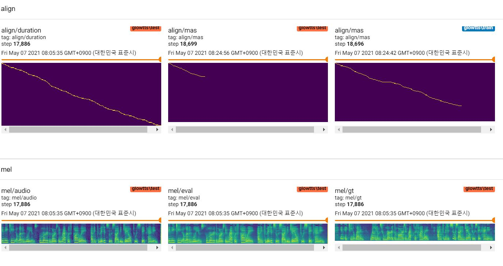

# tf-glow-tts

(Unofficial) Tensorflow implementation of Glow-TTS, Jaehyeon Kim et al., in NeurIPS 2020. 

- Glow-TTS: A Generative Flow for Text-to-Speech via Monotonic Alignment Search [[arXiv:2005.11129](https://arxiv.org/abs/2005.11129)]
- Full code is based on original github repository [jaywalnut310/glow-tts](https://github.com/jaywalnut310/glow-tts)

## Requirements

Tested in python 3.8.5 windows10 conda environment, [requirements.txt](./requirements.txt)

## Usage

To download LJ-Speech dataset, run under script.

Dataset will be downloaded in '~/tensorflow_datasets' in tfrecord format. If you want to change the download directory, specify `data_dir` parameter of `LJSpeech` initializer.

```python
from dataset import LJSpeech
from dataset.config import Config

config = Config()
# lj = LJSpeech(config, data_dir=path, download=True)
lj = LJSpeech(config, download=True) 
```

To train model, run [train.py](./train.py). 

Checkpoint will be written on `TrainConfig.ckpt`, tensorboard summary on `TrainConfig.log`.

```bash
python train.py
tensorboard --logdir ./log/
```

If you want to train model from raw audio, specify audio directory and turn on the flag `--from-raw`.

```bash
python .\train.py --data-dir D:\LJSpeech-1.1\wavs --from-raw
```

To start to train from previous checkpoint, `--load-step` is available.

```bash
python .\train.py --load-step 416 --config ./ckpt/q1.json
```

To inference test set, run [COMMING-SOON/inference.py](./inference.py).

```bash
python .\inference.py
```

Pretrained checkpoints are relased on [COMMING-SOON/releases](https://github.com/revsic/tf-glow-tts/releases).

To use pretrained model, download files and unzip it. Followings are sample script.

```py
from config import Config
from glowtts import GlowTTS

with open('glowtts.json') as f:
    config = Config.load(json.load(f))

tts = GlowTTS(config.model)
tts.restore('./glowtts_20.ckpt-1').expect_partial()
```

## Learning Curve

train 20 epochs with [tf-diffwave](https://github.com/revsic/tf-diffwave), l1-1M steps.





## [COMMING-SOON] Samples

Reference [https://revsic.github.io/tf-glow-tts](https://revsic.github.io/tf-glow-tts).
